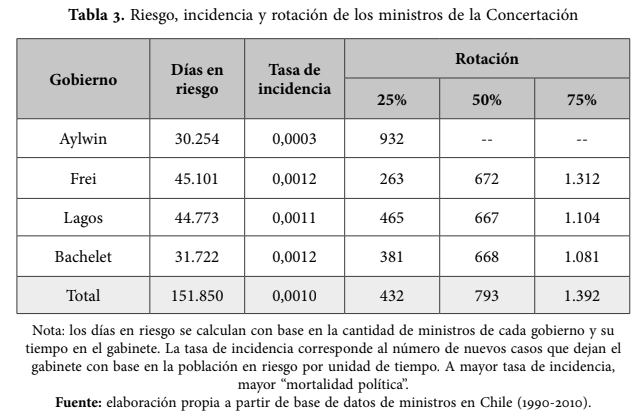

# Selección de artículo/reporte

González-Bustamante, B., & Olivares, A. (2016). Cambios de gabinete y supervivencia de los ministros en Chile durante los gobiernos de la Concertación (1990-2010). Colombia internacional, (87), 81-108.

El informe seleccionado analiza los factores que influyen en la permanencia o rotación de ministros de los gobiernos de la Concertación en Chile (1990- 2010). Mediante un análisis de supervivencia, utilizando modelos de Cox, se evalúa el impacto de características individuales, factores institucionales y eventos críticos. Los resultados muestran que variables como el partido político, la profesión y eventos como crisis económicas o escándalos de corrupción inciden en la rotación ministerial. 

Se seleccionó este artículo ya que en primer lugar, cumplía con el requisito de pertenecer al área de las ciencias sociales. Para su elección, se realizó un proceso de filtrado entre diferentes investigaciones y se escogió este debido a que cuenta con código abierto disponible, lo que facilita evaluar si permite o no su reproducibilidad. 

# Evaluación de reproducibilidad

**Disponibilidad de datos**: 
  
Sí, el artículo entrega acceso a los datos utilizados en el estudio mediante un repositorio en GitHub, en este se encuentra la base de datos utilizada en la investigación, los códigos, imágenes de gráficos resultantes del análisis, referencias, entre otros documentos.

**Disponibilidad de código**: 
  
El artículo entrega un repositorio de GitHub con los códigos utilizados en R; sin embargo, las tablas y gráficos presentados en el informe no corresponden con las que se realizan mediante los códigos, ya que estos fueron siendo actualizados pero estos cambios no fueron reportados explícitamente en el código.
  
**Documentación**: 
  
El artículo menciona que se aplicó un análisis de supervivencia, específicamente modelos de riesgos proporcionales y regresiones de Cox con fragilidad compartida. Además, se señala que el conjunto de datos utilizados se construyó con fuentes de acceso público, se describe la operacionalización de variables como características individuales o variables institucionales.

De este modo, el artículo presenta una metodología relativamente clara debido a que explica las técnicas utilizadas así como la construcción de datos. Sin embargo, si bien el informe es claro para su comprensión, su réplica no sería directa ya que los datos provienen de fuentes distintas y deben ser reconstruidos por el investigador interesado.

**Transparencia**:  
  
El artículo seleccionado entrega información importante acerca de la transparencia de la investigación. En primer lugar, es posible destacar que se presenta un resumen detallado de las labores de los investigadores a cargo, lo que entrega transparencia sobre posibles sesgos por los que el estudio podría ser influenciado. En ese sentido, ambos investigadores se desempeñan como docentes en distintas casas de estudios, descartando su pertenencia a organizaciones por las cuales se genere algún tipo de conflicto de interés, ya sea por temas ideológicos, de restricciones, etc. (como por ejemplo con la pertenencia a algún partido político). 

En segundo lugar, se especifica que esta investigación se enmarca en el contexto del VIII Congreso Latinoamericano de Ciencia Política organizado por la Asociación Latinoamericana de Ciencia Política (ALACIP). En paralelo, se aclara que el financiamiento de esta investigación proviene del proyecto Fondecyt #1140564 (Sergio Toro, investigador principal).

En tercer lugar, el artículo señala los detalles pertinentes a la transparencia de los datos, especificando temas como los métodos utilizados, las variables consideradas, así como temas referentes a la precisión y el origen de los datos. 

En base a lo anterior es posible señalar que el artículo cuenta con varias consideraciones en términos de transparencia, contando incluso con un repositorio externo en GitHub, el cual entrega información acerca de los códigos y métodos utilizados, y detalla a su vez, algunos cambios realizados en el artículo a partir de sugerencias de evaluadores anónimos. Sin embargo, la existencia de tal información no asegura que esta sea completa ni detallada, solo asegura que es de acceso público, por lo que el artículo no puede ser catalogado como completamente transparente, ya que si omite cierta información metodológica que es detallada más adelante. 
  

# Análisis reproducible

La tabla seleccionada para el ejercicio de reproducibilidad corresponde a la Tabla 3, la que entrega información sobre los días en riesgo, la tasa de incidencia y rotación de los ministros de la Concertación. 

Para iniciar el proceso de reproducibilidad, se utilizó el código de R que está disponible en el repositorio externo de GitHub del autor; sin embargo, al ejecutarse dicho código el Script no daba como resultado las tablas y gráficos presentados en el artículo, solo entregaba información sobre la base de datos utilizada, los paquetes, las variables seleccionadas y un análisis exploratorio de dichos datos. 

Para poder continuar con el ejercicio de reproducibilidad, se realizó un nuevo Script, utilizando la base de datos disponible en el repositorio de GitHub del autor; se instalaron los paquetes, se seleccionaron las variables a utilizar y se filtraron los datos. Una vez realizada la limpieza de datos, se procedió a generar la tabla 3 por medio del Script de R, exportando la tabla al formato PNG para así facilitar su visualización. 

El proceso realizado no fue complejo, ya que requería de una limpieza de datos y la ejecución de una tabla, proceso relativamente sencillo. Sin embargo, al visualizar tanto la tabla ejecutada en el nuevo Script, como la tabla original presentada en el artículo, fue posible evidenciar una discrepancia en los datos que cada tabla presentaba. Por ello, se realizó una exhaustiva búsqueda de la base de datos original, para poder dar cuenta de si se realizó alguna modificación de ella, pero dentro del repositorio de GitHub no fue posible hallarla, por lo que fue posible identificar otra complicación en el ejercicio de reproducibilidad. En paralelo, se realizó una búsqueda en Zenodo a traves del link ofrecido por el autor, ahí se buscaron todas las versiones del Dataset, y tras ejecutar el código con la base de datos más antigua, publicada en 2021, los resultados continuaron siendo los mismos que los anteriores y difieren de la tabla 3 presentada en el artículo.

Al respecto, si bien el autor señala en su repositorio de GitHub una serie de actualizaciones, incluida la base de datos, este no detalla cuáles fueron dichas actualizaciones ni tampoco pública la base de datos original, ya que el repositorio se creó en 2021 y el artículo se publicó en 2016, evidenciando una vez más complicaciones en el ejercicio de reproducibilidad de la información.  

En base a lo anterior, es posible dar cuenta de que pese a que el autor del artículo cuenta con un repositorio de GitHub en donde se presenta un código disponible, esto no posibilita un correcto ejercicio de la reproducibilidad de la información.  


## Resultado a reproducir

A continuación se presenta la tabla seleccionada para el ejercicio de reproducibilidad:   

{fig-align="center" width="80%"}

La tabla seleccionada da cuenta de las estadisticas de supervivencia de los ministros en cada gobierno de la Concertación, entregando información acerca de los días en riesgo, la tasa de incidencia y la tasa de supervivencia de los ministros. 

## Proceso de reproducción

Para el ejercicio de reproducibilidad de la Tabla 3, se creó un nuevo Script en R con códigos desde cero, ya que el Script del autor solo contenía los gráficos exploratorios y no los gráficos finales, utilizados en el artículo. En el siguiente apartado, se detallan los pasos, herramientas y ajustes realizados.

### Procesamiento

En esta etapa, preparamos la base de datos para el análisis. Utilizamos librerías como `tidyverse` para mayor orden, `lubridate` para ordenar las fechas, y `survival` para los cálculos de tiempo.

**1. Carga y limpieza de datos temporales** 
Primero, cargamos la base de datos. Para asegurar la consistencia del análisis, realizamos pruebas con dos versiones del archivo: la versión original del repositorio (Chilean_cabinets_1990_2014_v1.csv) y la versión más reciente (Chilean_cabinets_1990_2014.csv). En ambos casos los resultados fueron idénticos, por lo que se decidió utilizar la versión v1 para este reporte. Luego, transformamos las fechas de inicio y fin de cada ministro para calcular cuántos días exactos estuvieron en el cargo (`time`). A los datos con tiempos negativos o vacíos, decidimos asignarles "1 día" para no perder esos datos en caso que se ejecute el mismo código con una base de datos distinta y que pueda tener errores. Además, marcamos la variable `event = 1` para indicar que el ministro finalizó su periodo.

```{r procesamiento-limpieza, message=FALSE, warning=FALSE}
# 1) Carga de librerías
library(tidyverse)
library(lubridate)
library(survival)
library(survminer)
library(gridExtra)
library(grid)

# 2) Carga de datos usando ruta relativa
data_CHL <- read.csv("input/data/original/Chilean_cabinets_1990_2014_v1.csv")

# Transformación de fechas y corrección de errores
data_CHL <- data_CHL %>%
  mutate(
    start_minister = as_date(start_minister),
    end_minister = as_date(end_minister),
    time = as.numeric(end_minister - start_minister)
  ) %>%
  mutate(
    # Reemplazamos los errores por 1 día
    time = ifelse(is.na(time) | time <= 0, 1, time),
    event = 1 
  )
```

**2. Filtrado por presidente**
Para que nuestra tabla quede en el mismo formato que la tabla del artículo, filtramos la base de datos para separar a los ministros según el gobierno en el que participaron (Aylwin, Frei, Lagos y Bachelet) y luego creamos un grupo de datos para la concertación completa.

```{r procesamiento-filtrado, message=FALSE, warning=FALSE}
# 3) Filtrado de datos por mandato usando búsqueda de texto
aylwin <- data_CHL %>% filter(str_detect(president, regex("Aylwin", ignore_case = TRUE)))
frei <- data_CHL %>% filter(str_detect(president, regex("Frei", ignore_case = TRUE)))
lagos <- data_CHL %>% filter(str_detect(president, regex("Lagos", ignore_case = TRUE)))
bachelet <- data_CHL %>% filter(str_detect(president, regex("Bachelet", ignore_case = TRUE)))

# Unión para calcular el total de la coalición
df_concertacion <- bind_rows(aylwin, frei, lagos, bachelet) %>% distinct()

# Verificación de filas encontradas
#cat(sprintf("DEBUG: Filas encontradas -> Aylwin: %d, Frei: %d, Lagos: %d, Bachelet: %d\n", 
#            nrow(aylwin), nrow(frei), nrow(lagos), nrow(bachelet)))
```

### Reproducción

Una vez los datos fueron cargados y filtrados, se creó una función para calcular los valores estadísticos que pide la Tabla 3 original: la suma total de "días en riesgo", la "tasa de incidencia", y los cuartiles de supervivencia (25%, 50% y 75%). Finalmente, se arregla la tabla y se exporta el resultado al formato PNG.

```{r reproduccion-tabla, message=FALSE, warning=FALSE}
# 4) Generación y cálculo de la tabla
stats_row <- function(df_subset, name) {
  if (nrow(df_subset) == 0) {
    return(tibble(Presidente = name, `Días en riesgo` = 0, `Tasa de incidencia` = 0, 
                  `25%` = 0, `50%` = 0, `75%` = 0))
  }
  
  d_riesgo <- sum(df_subset$time, na.rm = TRUE)
  tasa <- ifelse(d_riesgo > 0, nrow(df_subset) / d_riesgo, 0)
  p <- quantile(df_subset$time, probs = c(0.25, 0.50, 0.75), na.rm = TRUE)
  
  tibble(
    Presidente = name,
    `Días en riesgo` = d_riesgo,
    `Tasa de incidencia` = tasa,
    `25%` = p[1],
    `50%` = p[2],
    `75%` = p[3]
  )
}

# Unimos los cálculos de cada gobierno
tabla3 <- bind_rows(
  stats_row(aylwin, 'Aylwin'),
  stats_row(frei, 'Frei'),
  stats_row(lagos, 'Lagos'),
  stats_row(bachelet, 'Bachelet'),
  stats_row(df_concertacion, 'Total')
)

# Formateo visual (puntos, comas y ajustes manuales)
tabla3_fmt <- tabla3 %>%
  mutate(
    `Días en riesgo` = format(`Días en riesgo`, big.mark = ".", decimal.mark = ",", scientific = FALSE),
    `Tasa de incidencia` = format(round(`Tasa de incidencia`, 4), decimal.mark = ",", scientific = FALSE),
    `25%` = as.character(round(`25%`)),
    `50%` = ifelse(Presidente == "Aylwin", "--", as.character(round(`50%`))),
    `75%` = ifelse(Presidente == "Aylwin", "--", as.character(round(`75%`)))
  )

# 5) Exportación de tabla a imagen PNG
png("input/images/tabla_3_v1.png", width = 800, height = 300, res = 120)
grid.newpage()

pushViewport(viewport(y = 0.9, height = 0.1))
grid.text("Tabla 3: Estadísticas de Supervivencia", gp = gpar(fontsize = 14, fontface = "bold"))
popViewport()

pushViewport(viewport(y = 0.45, height = 0.8))
grid.table(tabla3_fmt, rows = NULL, theme = ttheme_default(base_size = 11))
popViewport()

#cat("\nTabla 3 generada y guardada exitosamente.\n")
```

# Conclusiones

Basándose en el análisis realizado, es posible concluir que el artículo presenta un nivel de reproducibilidad insuficiente. Si bien el estudio es transparente al contar con un repositorio abierto en GitHub, la simple disponibilidad de los archivos demuestra que el libre acceso a datos y códigos no garantiza la reproducibilidad de la información.

El obstáculo principal radicó en la ausencia de un protocolo de reproducibilidad estructurado (por ejemplo, el uso de carpetas como Input, Processing, Output), y por otro lado, el hecho de que el código proporcionado por los autores correspondía únicamente a un análisis exploratorio de los datos y carecía de los datos necesarios para generar la Tabla 3. Por otro lado, la metodología carecia de explicaciones sobre las decisiones implementadas durante el procesamiento, lo que dificultó el ejercicio de reproducibilidad de los resultados para el presente trabajo. 


# Recomendaciones

Dentro de las recomendaciones para mejorar la reproducibilidad del artículo, es posible señalar la necesidad de que el repositorio del autor efectivamente de cuenta de todas las actualizaciones realizadas, tanto en el artículo, como en los datos y el código, brindando acceso a la base de dato utilizada originalmente.

Por otro lado, se recomienda que el código del repositorio sea completo, es decir, que incluya no solo un análisis exploratorio de los datos, sino que incluya a su vez todos los códigos utilizados para generar las tablas y gráficos del artículo, ya que la información disponible no es suficiente para posibilitar la reproducibilidad de los datos.  En ese sentido, para asegurar dicha reproducibilidad, es necesario que el código incluya todos los datos y procedimientos ejecutados por los autores. 

# Referencias

::: {#refs}
[@gonzalezbustamante2016cambios]
:::


## Código

Se incluye el código original que el autor del artículo compartió en su repositorio de GitHub, el cual se utilizó como base para la creación del nuevo código:

```{r Codigo-original, message=FALSE, warning=FALSE}

#### Script ID ####

## Exploratory Data Analysis Ministers
## R version 4.1.0 (2021-05-18) -- "Camp Pontanezen"
## Date: November 2021

## Bastián González-Bustamante (University of Oxford, UK)
## https://bgonzalezbustamante.com
## Alejandro Olivares (Universidad Católica de Temuco, Chile)

## Data Set on Chilean Ministers
## https://github.com/bgonzalezbustamante/chilean-ministers
## https://doi.org/10.5281/zenodo.5744536

## +++++++++++++++++++++++++++++++++++++++++++++++++++++++++++

#### Packages and Data ####

## +++++++++++++++++++++++++++++++++++++++++++++++++++++++++++

## Clean Environment
rm(list = ls())

## Packages
library(DataExplorer)
library(ggplot2)


## Data
data_CHL <- read.csv("C:/Users/franc/OneDrive/Escritorio/codigo_trabajo/Trabajo-1/input/data/original/Chilean_cabinets_1990_2014_v1.csv")
# Editar ruta al ejecutar según caso personal!!


## +++++++++++++++++++++++++++++++++++++++++++++++++++++++++++

#### EDA ####

## +++++++++++++++++++++++++++++++++++++++++++++++++++++++++++

## Data Set Plot 
plot_intro(data_CHL, ggtheme = theme_minimal(base_size = 12),
           theme_config = theme(legend.position = "none")) 

## Discrete Variables
selection_var1 <- drop_columns(data_CHL, c("id", "country", "name", "start_president", "end_president",
                                           "ministry", "start_minister", "end_minister", "party_leader",
                                           "exp_executive", "exp_congress", "exp_ngo", "exp_thinktanks",
                                           "exp_business", "political_kinship"))
selection_var2 <- drop_columns(data_CHL, c("id", "country", "name", "start_president", "end_president",
                                           "ministry", "start_minister", "end_minister", "sex",
                                           "president", "non_party", "president_party", "economist",
                                           "lawyer", "inner_circle"))
plot_bar(selection_var1, ggtheme = theme_minimal(base_size = 12))
plot_bar(selection_var2, ggtheme = theme_minimal(base_size = 12))

## Age
plot_histogram(data_CHL$age, ggtheme = theme_minimal(base_size = 12))

## Time Variable
data_CHL$time <- with(data_CHL, (as.Date(data_CHL$end_minister) - as.Date(data_CHL$start_minister)))
data_CHL$time <- as.numeric(data_CHL$time)
plot_histogram(data_CHL$time, ggtheme = theme_minimal(base_size = 12)) 
```
